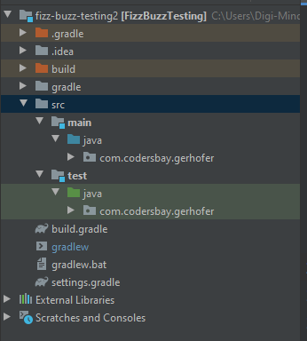
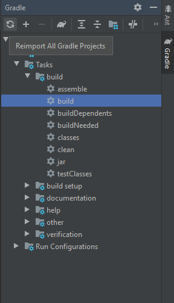

# Gradle 

Wir verwenden Gradle für das Dependency Management.
Gradle lädt für uns Bibliotheken aus dem Internet in der Version die wir angeben. 
Zum Testen brauchen wir die `JUnit` Bibliothek. 

Structure of a gradle project in IntelliJ:

Falls die src/main/java und src/test/java Ordner fehlen, dann können wir diese einfach erstellen.
Falls sie nicht richtig als Module oder Sources Root/Test sources root markiert sind (durch die Farbgebung) sollte dass duch einen Gradle refresh/reimport machbar sein. 
Dazu kannst du rechts im Gradle Menü den Reimport button klicken: 

